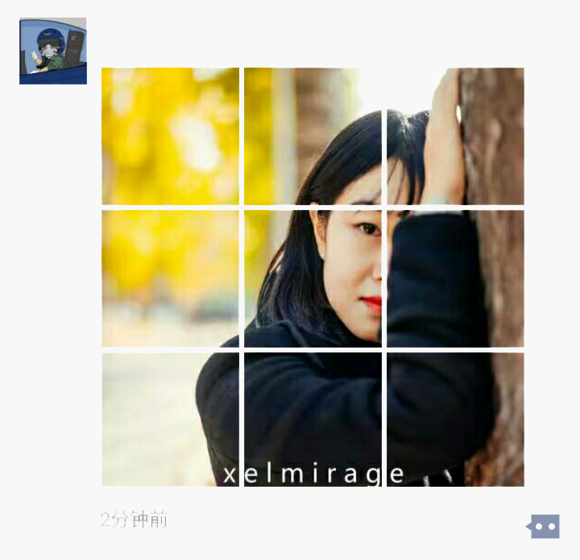

# wechat_image_cutter
cut image for wechat moments

usage：

 ` 
cut_for_moments(image_path_string, side_length)
 ` 
 
 `image_path_string`:image's full path, must be square
 
 `side_length`: 2 if 2x2, 3 if 3x3
 
# 微信切图脚本
朋友圈切图工具

说明：

 ` 
cut_for_moments(image_path_string, side_length)
 ` 
 
 `image_path_string`:图像路径，必须是正方形
 
 `side_length`: 2x2的田字格取2, 九宫格取3
 
